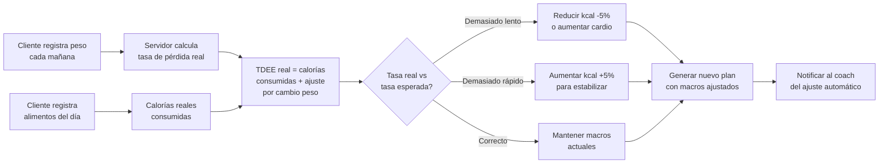
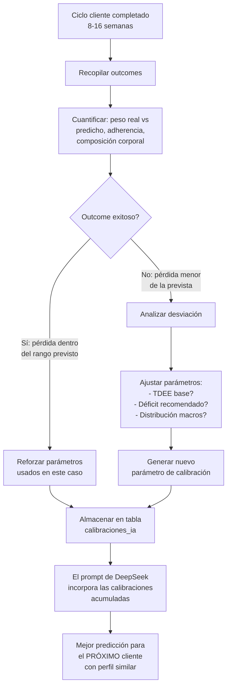

# 🧠 Estrategia de Mejora Continua — NutriCoach

> **Fecha:** 20-05-2026
> **Propósito:** Hoja de ruta para forkear y superar a los competidores más relevantes del mercado, integrando un sistema de mejora continua basado en papers científicos, outcomes de clientes y aprendizaje automático.
> **Estado:** Borrador inicial — pendiente de revisión y aprobación

---

## 📊 Índice

1. [Análisis Competitivo](#1-análisis-competitivo)
2. [Nuestra Posición Actual](#2-nuestra-posición-actual)
3. [Pilares de Mejora Continua](#3-pilares-de-mejora-continua)
4. [Hoja de Ruta — Faseada](#4-hoja-de-ruta--faseada)
5. [Arquitectura del Sistema de IA Evolutivo](#5-arquitectura-del-sistema-de-ia-evolutivo)
6. [Pipeline de Papers Científicos](#6-pipeline-de-papers-científicos)
7. [Sistema de Feedback Loop Cliente → IA](#7-sistema-de-feedback-loop-cliente--ia)
8. [Métrica de Progreso: NutriCoach IQ](#8-métrica-de-progreso-nutricoach-iq)
9. [Priorización y Dependencias](#9-priorización-y-dependencias)

---

## 1. Análisis Competitivo

### 1.1 Tabla Comparativa

| Competencia | Fortaleza principal | Debilidad | Qué podemos forkear | Prioridad |
|---|---|---|---|---|
| **MacroFactor** | TDEE dinámico que se ajusta SOLO con la adherencia real. Algoritmo de ajuste de macros semanal basado en peso real vs esperado. Workout API completa. | Solo app mobile. Sin recetas reales. Sin coaching humano. Sin planificación de comidas estructurada. | Algoritmo de ajuste de macros por adherencia (MCP server). Sistema de TDEE dinámico con `get_nutrition`, `get_weight_log`. Workout logging con sets, reps, RIR. | 🔴 Alta |
| **wger** | Open-source. API REST completa para nutrición (nutritionplan, meal, mealitem, nutritiondiary) y entrenos (workoutsession, workoutlog, exercise DB con UUIDs). Taxonomía muscular y de equipamiento. Comunitaria. | UI obsoleta. Sin IA. Sin personalización real. Sin recetas. | Estructura de exercise DB con músculos, equipamiento, categorías. Sistema de workout logging con estimated 1RM basado en reps y peso. WorkoutSession con RIR/RPE. | 🔴 Alta |
| **FatSecret** | Food diary con 3-legged OAuth. Foods API con serving descriptions y metric amounts. Saved meals (CRUD). Recipe favorites. Most-eaten/recently-eaten foods. | Sin IA. Sin personalización. API legacy OAuth 1.0. | Sistema de Saved Meals (comidas favoritas del cliente con cantidades exactas). Sistema de "comidas recientes/más usadas" para logging rápido. Food diary estandarizado (create/edit/copy entre fechas). | 🟡 Media |
| **Open Food Facts** | 2.9M+ productos. Barcode lookup. Nutri-Score, Eco-Score. Multilingual. Ingredient analysis con additives y alérgenos. | Base de datos comunitaria (calidad variable). Sin personalización. Sin planes. | Barcode scan → lookup nutricional. Nutri-Score para evaluar calidad de planes. Ingredient-level analysis (additives, ultra-processed flags). | 🟡 Media |
| **RP Strength** | Auto-regulation de macros. Diet breaks programados. Periodización para physique athletes. | Solo para culturismo. Sin recetas reales. Sin IA. Sin food logging. | Prototipos de auto-regulation (diet breaks programados). RP's approach to refeed/carb cycling ya implementado parcialmente en mesociclos. | 🟢 Baja |
| **MyFitnessPal** | Base de datos masiva. Food logging por barcode. Social features. | UX saturada. Sin coaching. Sin personalización real. Sin IA. | Patrones de UX de logging rápido. Búsqueda predictiva de alimentos. | 🟢 Baja |

### 1.2 Análisis por Feature Vertical

#### 🥇 MacroFactor — El Benchmark a Batir

**Qué hace mejor:**
- **TDEE Adaptativo**: Calcula TDEE en tiempo real basado en peso corporal y calorías registradas. Se ajusta automáticamente cada semana.
- **Ajuste Algorítmico de Macros**: Si el peso no cambia como se esperaba, ajusta las calorías (no espera al coach).
- **Adherence-Based Adjustments**: Considera la tasa de adherencia al registro de alimentos para calibrar la confianza en los datos.
- **Workout API Completa**: `log_workout`, `log_exercise`, `update_workout_set`, `get_workout_history`, `search_exercises`, `resolve_muscle`, `resolve_equipment`.
- **Nutrition API Rica**: `get_nutrition` por fecha, `get_food_log`, `search_foods`, `log_food`, `log_food_by_id`.

**Qué NO tiene (nuestra ventaja):**
- ❌ Recetas reales con fotos e ingredientes (nosotros: 227 recetas)
- ❌ Plan de comidas estructurado (nosotros: DeepSeek genera plan completo)
- ❌ Coaching humano (nosotros: auto-coach + coach real)
- ❌ Micro-learning educativo (nosotros: gap #8)
- ❌ Validación de micronutrientes (nosotros: gap #7)
- ❌ Nutrición peri-entreno (nosotros: gap #4)
- ❌ Mesociclos con periodización (nosotros: gap #2)
- ❌ Distribución estratégica de proteína (nosotros: gap #3)

**Conclusión:** MacroFactor es MEJOR en el loop de ajuste continuo (log → analizar → ajustar). Nosotros somos MEJORES en la generación inicial del plan (recetas reales + ciencia + personalización profunda). La estrategia: **forkear el loop de ajuste continuo de MacroFactor** y combinarlo con nuestra generación inicial superior.

#### 🏋️ wger — El Open-Source Reference Model

**Qué hace mejor:**
- **Exercise Database**: UUIDs por ejercicio, categorías por grupo muscular, equipamiento, variaciones. Traducciones multi-idioma vía Weblate. Comunitaria.
- **Workout Logging**: `POST /api/v2/workoutsession/` con `impression` (cómo se sintió), `time_start`, `time_end`. `POST /api/v2/workoutlog/` con `reps`, `weight`, `rir`, `estimated_1rm`.
- **Nutrition Plan**: Jerarquía plan → meal → mealitem con cantidades en gramos. Nutrition diary para logging diario.
- **REST API completa**: CRUD para todo, paginación, filtros.

**Qué podemos forkear:**
- La taxonomía de ejercicios con UUIDs y grupos musculares (nuestra actual es limitada)
- El sistema de workout logging con estimated 1RM basado en reps y peso (fórmula de Epley)
- La estructura de nutrition diary (log diario con datetime exacto)

#### 🍽️ FatSecret — Food Diary UX

**Qué hace mejor:**
- **3-Legged OAuth**: El usuario autoriza a la app a leer/escribir su food diary.
- **Food Diary CRUD**: Create/Edit/Delete entries por fecha y comida. Copy entries entre fechas y entre comidas.
- **Saved Meals**: Guardar combinaciones de alimentos como "meal" reutilizable.
- **Recipe Favorites**: Marcar recetas como favoritas.
- **Most-Eaten / Recently-Eaten**: Lista de alimentos que más usa el cliente.

**Qué podemos forkear:**
- Sistema de "Mis comidas guardadas" (el cliente guarda su desayuno típico y lo reusa)
- Food diary con copia entre fechas (útil para meal prep)
- Algoritmo de "más usados" para logging rápido

#### 🌍 Open Food Facts — Product Database

**Qué hace mejor:**
- **2.9M+ productos** con barcode, ingredientes, nutricionales, Nutri-Score, Eco-Score
- **Barcode lookup**: `GET /api/v2/product/{barcode}`
- **Análisis de ingredientes**: Additives, alérgenos, ultra-processed flags (NOVA classification)
- **Multilingual**: Datos en 150+ idiomas
- **Contribución**: Cualquier usuario puede añadir/editar productos

**Qué podemos forkear:**
- Barcode scan → auto-completar datos nutricionales
- Nutri-Score para planes y recetas
- Alérgenos automáticos desde ingredientes
- NOVA classification para detectar ultra-processed foods

---

## 2. Nuestra Posición Actual

### 2.1 Lo que YA tenemos (fortalezas)

| Capacidad | Estado | Detalle |
|---|---|---|
| Generación IA de planes | ✅ Completo | DeepSeek V3 con recetas reales, 18 protocolos científicos, perfil completo del cliente |
| Recetario real | ✅ 227 recetas | Fotos, ingredientes vinculados, macros calculados, categorizadas |
| Mesociclos nutricionales | ✅ 5 modos | Déficit, bulk, rendimiento, recomposición, mantenimiento |
| Distribución proteína MPS | ✅ Completo | Threshold por edad, leucina, post-entreno boost, sarcopenia alert |
| Auto-coach + feedback loop | ✅ Completo | Análisis de check-ins, peso, adherencia, energía, sueño → periodización |
| 18 protocolos científicos | ✅ Completo | Cobertura: déficit/superávit, diabetes, HTA, dislipemia, hígado graso, embarazo |
| Nutrición peri-entreno | ✅ Gap #4 | Pre/intra/post sincronizado con modalidad y segmento |
| Validación micronutrientes | ✅ Gap #7 | Sodio, azúcares, fibra, umbrales por condición |
| Micro-learning | ✅ Gap #8 | 18 píldoras educativas por perfil, flags psicológicos, condiciones |
| Motor de entrenos básico | ✅ Gap #9 | Evaluación de perfil, filtro de plantillas, recomendación integrada |
| Scraping 7 supermercados | ✅ 7,765 productos | Mercadona, Consum, Alcampo, Carrefour, Bonpreu, Esclat, Eroski |
| Precios y escandallo | ✅ Completo | Múltiples productos por alimento, vistas de mejor precio, selector UI |
| Onboarding autónomo | ✅ Completo | Invitación → registro → cuestionario → plan |
| Dashboard y portal cliente | ✅ Completo | AutoCoachPanel, check-ins, feedback IA |
| Design System v6 | ✅ Completo | Graphite Apple Pro, dark/light mode, responsive mobile |

### 2.2 Lo que NOS FALTA (vs competidores)

| Gap | Competidor referencia | Prioridad | Esfuerzo |
|---|---|---|---|
| **TDEE dinámico** con ajuste semanal automático por adherencia real | MacroFactor | 🔴 Crítico | Alta |
| **Food diary** con logging diario, escaneo barcode, comidas guardadas | FatSecret + OFF | 🔴 Crítico | Alta |
| **Workout logging** con RIR/RPE, estimated 1RM, taxonomía muscular completa | wger | 🔴 Crítico | Alta |
| **Pipeline de papers** → ingesta automática → knowledge base | — | 🔴 Crítico | Media |
| **Aprendizaje de outcomes**: outcomes reales de clientes mejoran predicciones IA | — | 🟡 Importante | Alta |
| **Nutri-Score** para evaluar calidad nutricional de planes | Open Food Facts | 🟡 Importante | Baja |
| **Eco-Score / Sostenibilidad** | Open Food Facts | 🟢 Nice-to-have | Baja |
| **Gamificación**: streaks, logros, adherencia tracking | — | 🟢 Nice-to-have | Media |
| **MCP server** para integración externa | MacroFactor | 🟢 Nice-to-have | Media |
| **App mobile nativa** | Todos | 🟡 Importante | Muy Alta |

---

## 3. Pilares de Mejora Continua

```
                    ┌─────────────────────────────────────┐
                    │       NUTRICOACH INTELLIGENCE        │
                    │         IQ = f(ciencia, datos,       │
                    │              feedback loop)          │
                    └──────────────────┬──────────────────┘
                                       │
            ┌──────────────────────────┼──────────────────────────┐
            │                          │                          │
            ▼                          ▼                          ▼
    ┌─────────────────┐     ┌─────────────────────┐     ┌──────────────────┐
    │   PILLAR 1      │     │     PILLAR 2        │     │   PILLAR 3       │
    │ CIENCIA VIVA    │     │  AJUSTE DINÁMICO    │     │  APRENDIZAJE     │
    │                 │     │                     │     │  POR OUTCOMES    │
    │ Pipeline papers │     │ TDEE adaptativo     │     │ Resultados reales│
    │ → KB dinámica   │     │ Ajuste macros x     │     │ → peso real vs   │
    │ 18→∞ protocolos │     │ adherencia real     │     │   esperado       │
    │                 │     │ Workout logging     │     │ → mejora prompts │
    │ Papers nuevos = │     │ Food diary con      │     │ → calibración    │
    │   nuevo        │     │   escaneo barcode    │     │   predicciones   │
    │ conocimiento   │     │                     │     │                  │
    └────────┬────────┘     └──────────┬──────────┘     └────────┬─────────┘
             │                         │                         │
             └─────────────────────────┼─────────────────────────┘
                                       │
                                       ▼
                          ┌─────────────────────────┐
                          │    CLIENTE REAL         │
                          │  Logs comida, entrena,  │
                          │  hace check-in, pierde/  │
                          │  gana peso, da feedback  │
                          └─────────────────────────┘
```

### Pilar 1: Ciencia Viva

El conocimiento científico no es estático. Cada semana salen nuevos papers de nutrición, entrenamiento y fisiología. Nuestro sistema debe:
- **Detectar** papers relevantes automáticamente (PubMed RSS, arXiv, alertas de investigadores clave)
- **Extraer** hallazgos clave (vía DeepSeek-reader)
- **Evaluar** nivel de evidencia (RCT > meta-análisis > cohorte > opinión experta)
- **Incorporar** al knowledge base si supera el umbral de calidad
- **Actualizar** protocolos existentes si hay nueva evidencia más fuerte

**Estado actual:** 18 protocolos hardcodeados en [`lib/knowledge-base.ts`](lib/knowledge-base.ts). Necesitamos una `knowledge_base` dinámica en Supabase.

### Pilar 2: Ajuste Dinámico (Fork MacroFactor)

El plan inicial generado por IA es excelente, pero el mundo real cambia. Necesitamos:
- **TDEE calculado en vivo**: Peso actual + calorías consumidas reales → TDEE real (no fórmula estimada)
- **Ajuste semanal de macros**: Si el peso no baja al ritmo esperado, ajustar calorías automáticamente
- **Food diary**: El cliente registra lo que realmente come (no solo lo que el plan dice)
- **Workout logging**: El cliente registra entrenos reales → ajuste de carbs peri-entreno dinámico
- **Adherence-aware**: Si el cliente registra 60% de adherencia, el ajuste es más conservador (no sabemos exactamente qué comió el 40% restante)

### Pilar 3: Aprendizaje por Outcomes

Cada cliente que completa un ciclo genera datos valiosos:
- **Predicción vs realidad**: El plan decía "pierde 0.5kg/semana" → ¿realmente perdió eso?
- **Qué funciona para quién**: ¿Clientes con perfil X responden mejor a déficit agresivo vs moderado?
- **Refinamiento de prompts**: Los prompts de DeepSeek deben mejorar con cada iteración basada en resultados reales
- **Calibración de TDEE**: La fórmula de TDEE debe calibrarse con datos reales de N clientes

---

## 4. Hoja de Ruta — Faseada

### Fase 0: Consolidación (ahora — 1 semana)
> Preparar la infraestructura base para todo lo demás

| # | Tarea | Archivos | Dependencias |
|---|---|---|---|
| 0.1 | Migrar knowledge_base de hardcodeado a tabla Supabase dinámica | `supabase_knowledge_base.sql` + nuevo `lib/knowledge-base-dinamica.ts` | — |
| 0.2 | Migración SQL: `knowledge_base` table con nivel_evidencia, condiciones, tags, DOI, enlace_paper | `supabase_knowledge_base.sql` | — |
| 0.3 | Seed de los 18 protocolos actuales en la nueva tabla | Script seed | 0.1 |
| 0.4 | Pipeline de ingesta de papers: PubMed RSS + DeepSeek-reader + evaluador → INSERT | `lib/ingesta-papers/` | 0.1 |
| 0.5 | Migrar `especialidades` y `perfil_alimentario` a `cliente_kb_tags` para matching dinámico | Migración SQL + `lib/knowledge-base.ts` refactor | 0.1 |
| 0.6 | Build de verificación + deploy Vercel | — | 0.1-0.5 |

### Fase 1: TDEE Dinámico + Ajuste por Adherencia (1-2 semanas)
> Fork del corazón de MacroFactor



| # | Tarea | Archivos | Dependencias |
|---|---|---|---|
| 1.1 | API endpoint `POST /api/log-peso` para registro diario de peso | `app/api/log-peso/route.ts` | — |
| 1.2 | API endpoint `POST /api/log-comida` para food diary básico | `app/api/log-comida/route.ts` | — |
| 1.3 | Tabla `registro_peso_diario` en Supabase | Migración SQL | — |
| 1.4 | Tabla `registro_comidas_diario` en Supabase | Migración SQL | — |
| 1.5 | Algoritmo de cálculo de TDEE real (basado en peso + calorías registradas de los últimos 7-14 días) | `lib/ajuste-dinamico/tdee-real.ts` | 1.1, 1.2 |
| 1.6 | Algoritmo de ajuste semanal de macros (fork de MacroFactor) | `lib/ajuste-dinamico/ajuste-macros.ts` | 1.5 |
| 1.7 | Integración con el sistema de periodización existente (mesociclos) | `lib/periodizacion/motor-macros.ts` + nueva lógica | 1.6 |
| 1.8 | Notificación al coach del ajuste automático | `lib/notificaciones/` | 1.6 |
| 1.9 | UI para que el coach vea el historial de ajustes automáticos | Componente dashboard | 1.8 |

### Fase 2: Food Diary Completo (2 semanas)
> Fork de FatSecret + Open Food Facts

| # | Tarea | Archivos | Dependencias |
|---|---|---|---|
| 2.1 | Barcode scan: integración con Open Food Facts API para lookup de productos | `lib/barcode-scanner.ts` | — |
| 2.2 | UI de escaneo de código de barras (cámara → barcode → lookup → mostrar datos) | Componente `BarcodeScanner` | 2.1 |
| 2.3 | Sistema de "Mis comidas guardadas" (client can save breakfast/lunch/dinner) | `lib/comidas-guardadas.ts` + API | — |
| 2.4 | Sistema de "alimentos recientes/más usados" para logging rápido | `lib/alimentos-frecuentes.ts` | — |
| 2.5 | Food diary UI: logging por fecha, copiar entre fechas, editar entradas | Componente `FoodDiary` | 2.3, 2.4 |
| 2.6 | Integración food diary → motor de ajuste (Fase 1) | `lib/ajuste-dinamico/tdee-real.ts` | 2.5, 1.5 |
| 2.7 | Nutri-Score para evaluar calidad nutricional de cada comida del plan | `lib/nutri-score.ts` | — |
| 2.8 | Detección de ultra-processed foods (NOVA classification vía OFF) | `lib/ultra-processed.ts` | 2.1 |

### Fase 3: Workout Logging Avanzado (2 semanas)
> Fork de wger + mejora de nuestro motor de entrenos (Gap #9)

| # | Tarea | Archivos | Dependencias |
|---|---|---|---|
| 3.1 | Enriquecer exercise DB: añadir taxonomía muscular, equipamiento, UUIDs, categorías | Migración SQL + seed | — |
| 3.2 | API `POST /api/log-workout` para registrar sesión de entreno | `app/api/log-workout/route.ts` | — |
| 3.3 | Workout logging UI: sets, reps, peso, RIR, cómo se sintió | Componente `WorkoutLogger` | 3.2 |
| 3.4 | Algoritmo estimated 1RM (Epley formula) basado en reps-to-failure | `lib/workout/estimated-1rm.ts` | — |
| 3.5 | Integración workout logging → ajuste de carbs peri-entreno dinámicos | `lib/nutricion-peri-entreno.ts` extendido | 3.3 |
| 3.6 | Historial de entrenos con progresión de carga automática sugerida | Componente `WorkoutHistory` | 3.3 |
| 3.7 | Integración con auto-coach: fatiga por entrenos → recomendaciones | `lib/auto-coach.ts` extendido | 3.5 |

### Fase 4: Aprendizaje por Outcomes (3 semanas)
> El sistema se vuelve más inteligente con cada cliente



| # | Tarea | Archivos | Dependencias |
|---|---|---|---|
| 4.1 | Tabla `calibraciones_ia` en Supabase: perfil_cliente, parametro, valor_calibrado, n_muestras | Migración SQL | — |
| 4.2 | Algoritmo de recopilación de outcomes al finalizar ciclo: comparar peso real vs predicho semana a semana | `lib/outcomes/analizar-ciclo.ts` | Fase 1, Fase 2 |
| 4.3 | Algoritmo de calibración: calcular desviación media y ajustar parámetros TDEE/déficit | `lib/outcomes/calibrar.ts` | 4.2 |
| 4.4 | Incorporar calibraciones en el prompt de DeepSeek para nuevos planes | `lib/deepseek.ts` → `construirPrompt()` modificado | 4.3 |
| 4.5 | Dashboard de "NutriCoach IQ" para coach: ver cómo mejora la precisión con el tiempo | Componente `DashboardIQ` | 4.4 |

### Fase 5: Gamificación y Adherencia (1-2 semanas)

| # | Tarea | Archivos | Dependencias |
|---|---|---|---|
| 5.1 | Sistema de streaks (días consecutivos de logging) | `lib/gamificacion/streaks.ts` | Fase 2 (food diary) |
| 5.2 | Logros y badges por hitos (primer check-in, 30 días de adherencia >80%, etc.) | `lib/gamificacion/logros.ts` | 5.1 |
| 5.3 | Notificaciones push PWA para recordatorios de logging | `hooks/useNotificaciones.ts` extendido | — |
| 5.4 | Resumen semanal automático con celebración de progreso | `lib/auto-coach.ts` → nuevo tipo resumen | — |

### Fase 6: MCP Server + Integración Externa (opcional)

| # | Tarea | Archivos | Dependencias |
|---|---|---|---|
| 6.1 | MCP server estilo MacroFactor para que agentes externos lean/escriban datos | `mcp-server/` | Fase 1, 2, 3 |
| 6.2 | Integración con wearables (Apple Health, Garmin, Whoop) para datos de sueño/HRV/actividad | `lib/integraciones/` | — |

---

## 5. Arquitectura del Sistema de IA Evolutivo

### 5.1 Diagrama de Componentes

```
┌─────────────────────────────────────────────────────────────────────┐
│                       NUTRICOACH AI BRAIN                          │
├─────────────────────────────────────────────────────────────────────┤
│                                                                     │
│  ┌──────────────────────┐    ┌──────────────────────────────────┐  │
│  │   KNOWLEDGE BASE     │    │     DEEPSEEK ORCHESTRATOR       │  │
│  │                      │    │                                  │  │
│  │  knowledge_base      │◄──►│  construirPrompt()              │  │
│  │  (tabla Supabase)    │    │  - perfil_cliente               │  │
│  │  - 18+ protocolos   │    │  - protocolos seleccionados     │  │
│  │  - nivel_evidencia  │    │  - calibraciones_ia             │  │
│  │  - condiciones      │    │  - recetas reales               │  │
│  │  - tags              │    │  - feedback histórico           │  │
│  │  - DOI, enlace      │    │                                  │  │
│  └──────────┬───────────┘    └────────────────┬─────────────────┘  │
│             │                                  │                    │
│             ▼                                  ▼                    │
│  ┌──────────────────────┐    ┌──────────────────────────────────┐  │
│  │   INGESTA PAPERS     │    │     AJUSTE DINÁMICO (Fork MF)   │  │
│  │                      │    │                                  │  │
│  │  PubMed RSS →        │    │  tdee-real.ts                   │  │
│  │  DeepSeek reader →   │    │  - peso real + calorías reales  │  │
│  │  extractor →         │    │  ajuste-macros.ts               │  │
│  │  evaluador →         │    │  - si peso no baja: baja kcal   │  │
│  │  INSERT si umbral    │    │  - si peso baja mucho: sube     │  │
│  └──────────────────────┘    └────────────────┬─────────────────┘  │
│                                                │                    │
│  ┌──────────────────────┐    ┌─────────────────▼─────────────────┐  │
│  │   OUTCOMES LEARNER   │    │     FEEDBACK INTEGRATION         │  │
│  │                      │    │                                  │  │
│  │  analizar-ciclo.ts   │    │  auto-coach.ts (Gap #6)         │  │
│  │  calibrar.ts         │    │  - check-ins → ajuste           │  │
│  │  - outcomes reales   │    │  - energía, sueño, adherencia   │  │
│  │  - mejora prompts    │    │  - recomendaciones              │  │
│  │  - calibraciones_ia  │    │                                  │  │
│  └──────────────────────┘    └──────────────────────────────────┘  │
│                                                                     │
└─────────────────────────────────────────────────────────────────────┘
                               │
                               ▼
┌─────────────────────────────────────────────────────────────────────┐
│                     SISTEMA DE LOGGING (Cliente)                    │
├─────────────────────────────────────────────────────────────────────┤
│                                                                     │
│  ┌──────────────────────┐    ┌──────────────┐  ┌───────────────┐  │
│  │   FOOD DIARY         │    │ WORKOUT LOG  │  │  PESO DIARIO  │  │
│  │  (Fork FatSecret)    │    │ (Fork wger)  │  │               │  │
│  │                      │    │              │  │ Báscula → API │  │
│  │ - Escaneo barcode    │    │ - Sets/reps  │  │               │  │
│  │ - Comidas guardadas  │    │ - RIR/RPE    │  │              │  │
│  │ - Alimentos recientes│    │ - 1RM est.   │  │              │  │
│  │ - Copiar entre fechas│    │ - Fatiga     │  │              │  │
│  └──────────────────────┘    └──────────────┘  └───────────────┘  │
│                                                                     │
└─────────────────────────────────────────────────────────────────────┘
```

### 5.2 Flujo de Datos del Sistema Evolutivo

```
Semana 1: Cliente nuevo
  │
  ├── Perfil completo (edad, sexo, peso, objetivo, condiciones, etc.)
  ├── Knowledge base → seleccionar 5 protocolos más relevantes
  ├── Calibraciones_ia → aplicar ajustes históricos de perfiles similares
  ├── DeepSeek → generar plan personalizado con recetas reales
  │
  ▼
Semana 2-8: Cliente en ejecución
  │
  ├── Registra peso cada mañana → tabla registro_peso_diario
  ├── Registra comidas (barcode o manual) → tabla registro_comidas_diario
  ├── Registra entrenos (sets, reps, RIR) → tabla registro_entrenos
  ├── Hace check-in semanal (adherencia, energía, sueño) → tabla checkins
  │
  ▼
Cada lunes: Ajuste automático
  │
  ├── TDEE real = media calorías 7 días + ajuste por cambio peso
  ├── Comparar tasa pérdida real vs esperada
  ├── Si desviación > umbral → ajustar macros
  ├── Auto-coach revisa: energía, sueño, adherencia
  ├── Si todo OK → continuar. Si no → intervención (refeed, diet break, etc.)
  │
  ▼
Semana 8-16: Fin de ciclo
  │
  ├── Recopilar outcomes: peso inicial vs final, adherencia media, etc.
  ├── Almacenar en tabla outcomes
  ├── Calibrar: si cliente perdió X kg con parámetros Y, registrar
  ├── Incorporar calibración en prompts futuros
  │
  ▼
Próximo cliente con perfil similar → plan más preciso gracias a datos acumulados
```

---

## 6. Pipeline de Papers Científicos

### 6.1 Arquitectura

```
┌──────────────┐   ┌──────────────┐   ┌──────────────┐   ┌──────────────┐
│   FUENTES    │   │  EXTRACTOR   │   │  EVALUADOR   │   │  KNOWLEDGE   │
│              │   │              │   │              │   │     BASE     │
├──────────────┤   ├──────────────┤   ├──────────────┤   ├──────────────┤
│ PubMed RSS   │──►│ DeepSeek lee │──►│ Score 1-10:  │──►│ INSERT si    │
│ arXiv q-bio  │   │ el abstract  │   │ - Revista    │   │ score >= 7   │
│ Google       │   │ Extrae:      │   │ - Diseño     │   │              │
│  Scholar     │   │ - Hallazgo   │   │ - Tamaño     │   │ UPDATE si    │
│ Twitter/X    │   │ - Población  │   │ - Relevancia │   │ score >      │
│ feed         │   │ - Intervenc. │   │ para nuestro │   │ existente    │
│ Alertas      │   │ - Resultado  │   │ context      │   │              │
│  investigadores│  │ - DOI        │   │              │   │              │
└──────────────┘   └──────────────┘   └──────────────┘   └──────────────┘
```

### 6.2 Criterios de Inclusión

Un paper es candidato a incorporarse si:

| Criterio | Peso | Detalle |
|---|---|---|
| Revista indexada | 3 puntos | PubMed, Scopus, Web of Science |
| Diseño del estudio | 1-5 puntos | RCT=5, Meta-análisis=5, Cohort=3, Cross-sectional=1, Opinion=0 |
| Tamaño muestral | 1-3 puntos | n>1000=3, n>100=2, n<100=1 |
| Relevancia directa | 0-5 puntos | Nutrición deportiva=5, Nutrición clínica=4, Ejercicio=4, Bioquímica=2, Otro=0 |
| Contradice protocolo actual | - | Si es más fuerte, reemplaza. Si es más débil, ignora. |

**Umbral de inclusión:** ≥7 puntos

### 6.3 Fuentes Prioritarias Recomendadas

| Fuente | Tipo | Frecuencia | Papers/año estimados |
|---|---|---|---|
| **PubMed RSS** — términos: `sports nutrition`, `dietary protein`, `body composition`, `periodization`, `weight loss` | RSS feed | Diaria | ~50-100 relevantes |
| **Journal of the International Society of Sports Nutrition (JISSN)** | RSS feed | Mensual | ~10-20 |
| **Medicine & Science in Sports & Exercise** | RSS feed | Mensual | ~5-10 |
| **American Journal of Clinical Nutrition** | RSS feed | Mensual | ~5-10 |
| **Twitter/X: @BradSchoenfeld, @mennohenselstr, @AlanAragon, @EricTrexler, @BillCampbell** | API/Scrape | Diaria | ~5-20 |
| **Google Scholar Alerts** — términos clave | Email → Parse | Semanal | ~20-50 |

### 6.4 Archivos a Crear

| Archivo | Propósito |
|---|---|
| `lib/ingesta-papers/fuentes.ts` | Configuración de fuentes: RSS URLs, términos de búsqueda, tokens de API |
| `lib/ingesta-papers/extractor.ts` | Toma un abstract/texto y extrae hallazgo, población, intervención, resultado, DOI usando DeepSeek |
| `lib/ingesta-papers/evaluador.ts` | Evalúa calidad y relevancia del paper, devuelve score y recomendación |
| `scripts/ingestar-papers.mjs` | Script ejecutable manualmente o via Vercel Cron Job |
| `app/api/ingesta-papers/route.ts` | API endpoint para trigger manual desde el dashboard |
| `lib/knowledge-base-dinamica.ts` | Reemplazo de `lib/knowledge-base.ts`: lee de tabla Supabase en vez de hardcode |

---

## 7. Sistema de Feedback Loop Cliente → IA

### 7.1 El Ciclo Virtuoso

```
CICLO COMPLETADO
      │
      ▼
┌──────────────────────────────────────────────────────┐
│          1. RECOPILAR OUTCOMES DEL CICLO             │
│                                                      │
│  Datos a recopilar por cliente al finalizar ciclo:   │
│  - Peso inicial vs peso final                        │
│  - % grasa inicial vs final (si hay medición)        │
│  - Adherencia media al plan (%)                      │
│  - Adherencia media al logging de comida (%)         │
│  - Nº de check-ins completados                       │
│  - Satisfacción del cliente (1-10)                   │
│  - Nota del coach sobre el caso                      │
│  - Parámetros usados: TDEE base, déficit, macros     │
└──────────────────────┬───────────────────────────────┘
                       ▼
┌──────────────────────────────────────────────────────┐
│          2. CALCULAR DESVIACIÓN                      │
│                                                      │
│  - Peso predicho por el modelo vs peso real          │
│  - Si predijimos -0.5kg/semana y perdió -0.3kg/     │
│    semana → desviación = -40%                        │
│  - Si predijimos -0.5kg/semana y perdió -0.7kg/     │
│    semana → desviación = +40%                        │
│  - Si adherencia fue baja (<60%), la desviación      │
│    se pondera: no es culpa del modelo                │
└──────────────────────┬───────────────────────────────┘
                       ▼
┌──────────────────────────────────────────────────────┐
│          3. CALIBRAR PARÁMETROS                      │
│                                                      │
│  Por cada perfil de cliente (agrupado por sexo,      │
│  edad, objetivo, actividad):                         │
│                                                      │
│  - Si n >= 5 clientes con ese perfil:                │
│    - TDEE promedio real vs TDEE estimado             │
│    - Factor de corrección = TDEE_real / TDEE_est     │
│    - Almacenar en calibraciones_ia                   │
│                                                      │
│  - Si n >= 20 clientes:                              │
│    - Segmentar por sub-perfiles (ej: mujer >40       │
│      años con hipotiroidismo)                        │
│    - Calibración más precisa                         │
└──────────────────────┬───────────────────────────────┘
                       ▼
┌──────────────────────────────────────────────────────┐
│          4. MEJORAR PROMPTS DE DEEPSEEK              │
│                                                      │
│  construirPrompt() ahora incluye:                    │
│  "Basado en tus {n} clientes previos con perfil      │
│   similar, la calibración recomienda:                │
│   - TDEE base: {valor} kcal (vs estimación: {diff}) │
│   - Déficit recomendado: {valor}%                   │
│   - Factor de corrección: {factor}"                  │
└──────────────────────────────────────────────────────┘
```

### 7.2 Tablas Supabase Necesarias

```sql
-- Tabla: calibraciones_ia
CREATE TABLE IF NOT EXISTS public.calibraciones_ia (
    id uuid DEFAULT uuid_generate_v4() PRIMARY KEY,
    perfil_hash text NOT NULL UNIQUE, -- hash de (sexo, rango_edad, objetivo, actividad)
    sexo text NOT NULL,
    rango_edad text NOT NULL, -- '18-30', '31-45', '46-60', '60+'
    objetivo text NOT NULL, -- 'perdida_grasa', 'ganancia_muscular', 'rendimiento', etc.
    actividad text NOT NULL, -- 'sedentario', 'ligero', 'moderado', 'activo', 'muy_activo'
    tdee_estimado_media numeric, -- kcal, media de lo que estimamos
    tdee_real_media numeric, -- kcal, media de lo que realmente tenían
    factor_correccion_tdee numeric, -- tdee_real / tdee_estimado
    deficit_recomendado numeric, -- % de déficit que funciona mejor para este perfil
    deficit_real_efectivo numeric, -- % de déficit que realmente funcionó
    tasa_perdida_kg_semana_media numeric,
    n_muestras integer DEFAULT 1,
    created_at timestamptz DEFAULT now(),
    updated_at timestamptz DEFAULT now()
);

-- Tabla: outcomes_ciclo
CREATE TABLE IF NOT EXISTS public.outcomes_ciclo (
    id uuid DEFAULT uuid_generate_v4() PRIMARY KEY,
    cliente_id uuid REFERENCES public.clientes(id),
    plan_id uuid REFERENCES public.planes_nutricion(id),
    fecha_inicio date NOT NULL,
    fecha_fin date NOT NULL,
    peso_inicial numeric,
    peso_final numeric,
    adherencia_media_plan numeric, -- %
    adherencia_media_logging numeric, -- %
    checkins_completados integer,
    satisfaccion_cliente integer, -- 1-10
    nota_coach text,
    parametros_usados jsonb, -- { tdee_base, deficit, protein_gkg, etc }
    created_at timestamptz DEFAULT now()
);
```

---

## 8. Métrica de Progreso: NutriCoach IQ

Para medir objetivamente si el sistema está mejorando, definimos **NutriCoach IQ**:

### 8.1 Componentes del IQ

| Componente | Peso | Métrica | Estado actual | Target |
|---|---|---|---|---|
| **Precisión TDEE** | 30% | Diferencia media entre TDEE estimado vs real de N clientes | ❌ No medido | <5% error medio |
| **Precisión predicción peso** | 25% | Desviación media entre peso predicho vs real por ciclo | ❌ No medido | <0.2kg/semana |
| **Cobertura científica** | 15% | Nº de protocolos en knowledge base vs papers relevantes disponibles | 18 protocolos | 50+ protocolos |
| **Adherencia media** | 15% | % de adherencia al plan de todos los clientes activos | ❌ No medido | >80% adherencia |
| **Satisfacción cliente** | 10% | NPS o encuesta post-ciclo | ❌ No medido | >8/10 |
| **Auto-suficiencia** | 5% | % de ajustes automáticos que NO requieren intervención del coach | ❌ No medido | >70% automático |

### 8.2 Visualización

```
NUTRICOACH IQ: 45/100 (estimado inicial)
                           ┌────────────────────────────────────────┐
  Precisión TDEE (30%)    │████████░░░░░░░░░░░░░░░░░░░░░░  22/30 │ ❌
  Precisión predicción    │█████░░░░░░░░░░░░░░░░░░░░░░░░░  8/25  │ ❌
  Cobertura científica    │█████████████████░░░░░░░░░░░░  12/15 │ ✅
  Adherencia media        │██████░░░░░░░░░░░░░░░░░░░░░░░  6/15  │ ❌
  Satisfacción cliente    │████░░░░░░░░░░░░░░░░░░░░░░░░░  3/10  │ ❌
  Auto-suficiencia        │████░░░░░░░░░░░░░░░░░░░░░░░░░  1/5   │ ❌
                           └────────────────────────────────────────┘
```

---

## 9. Priorización y Dependencias

### 9.1 Orden de Implementación Recomendado

```
FASE 0 ─── 0.1 ── 0.2 ── 0.3 ── 0.4 ── 0.5 ── 0.6 ──► (1 semana)
             │
             ▼
FASE 1 ─── 1.1 ── 1.2 ── 1.3 ── 1.4 ── 1.5 ── 1.6 ── 1.7 ── 1.8 ── 1.9 ──► (1-2 semanas)
             │                                               │
             ▼                                               ▼
FASE 2 ─── 2.1 ── 2.2 ── 2.3 ── 2.4 ── 2.5 ── 2.6 ──── 2.7 ── 2.8 ──► (2 semanas)
             │                       │
             ▼                       ▼
FASE 3 ─── 3.1 ── 3.2 ── 3.3 ── 3.4 ── 3.5 ── 3.6 ── 3.7 ──► (2 semanas)
             │
             ▼
FASE 4 ─── 4.1 ── 4.2 ── 4.3 ── 4.4 ── 4.5 ──► (3 semanas) [requiere datos de F1+F2+F3]
             │
             ▼
FASE 5 ─── 5.1 ── 5.2 ── 5.3 ── 5.4 ──► (1-2 semanas)
```

### 9.2 Tabla Resumen por Prioridad

| Prioridad | Fase | Feature | Esfuerzo | Depende de | Valor |
|---|---|---|---|---|---|
| 🔴 P0 | 0 | Knowledge base dinámica en Supabase | 1 día | — | Base para todo lo demás |
| 🔴 P0 | 1 | TDEE dinámico + ajuste por adherencia | 5-7 días | Fase 0 | Competitividad core |
| 🔴 P0 | 2 | Food diary + barcode scan | 7-10 días | Fase 0 | Logging real → ajuste real |
| 🔴 P0 | 3 | Workout logging avanzado | 7-10 días | Fase 0 | Logging real → ajuste real |
| 🟡 P1 | 4 | Aprendizaje por outcomes | 10-15 días | Fase 1+2+3 | Mejora continua IA |
| 🟡 P1 | 5 | Gamificación | 5-7 días | Fase 2 | Adherencia |
| 🟢 P2 | 6 | MCP server | 3-5 días | Fase 1+2+3 | Integración externa |
| 🟢 P2 | Nutri-Score | Calidad planes | 1-2 días | Fase 2 | Diferenciación |

### 9.3 Estimación Total

| Fase | Tiempo estimado | Archivos nuevos | Archivos modificados |
|---|---|---|---|
| Fase 0 | 1 semana | 6 | 3 |
| Fase 1 | 1-2 semanas | 5 | 4 |
| Fase 2 | 2 semanas | 8 | 3 |
| Fase 3 | 2 semanas | 6 | 4 |
| Fase 4 | 3 semanas | 5 | 3 |
| Fase 5 | 1-2 semanas | 4 | 2 |
| **Total** | **10-12 semanas** | **~34 archivos** | **~19 archivos** |

---

## 📋 Checklist de Aprobación

Antes de pasar a implementación, el coach debe aprobar:

- [ ] **Orden de fases**: ¿Preferimos hacer Fase 1 (TDEE) antes que Fase 2 (food diary)? ¿O al revés?
- [ ] **Alcance Fase 0**: ¿Migrar knowledge base a Supabase es prioritario ahora?
- [ ] **App móvil**: ¿Queremos app nativa o seguimos con PWA?
- [ ] **MCP Server**: ¿Lo vemos útil para integrar con otras herramientas?
- [ ] **Papers**: ¿Hay algún área específica que quieras priorizar (ej: nutrición femenina, ayuno, etc.)?

---

> **Próximo paso:** Revisar este plan, ajustar prioridades, y pasar a implementación en modo Code.
