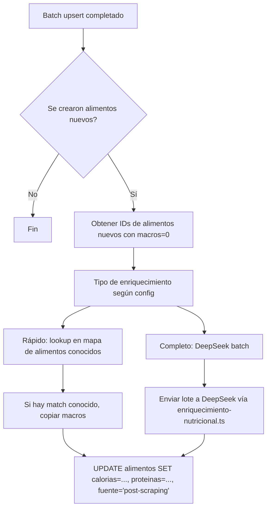
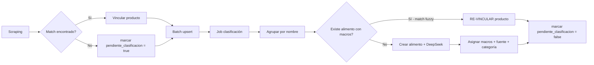

# Plan de Mejoras: BD Alimentos, Precios, Valores Nutricionales y Flujos

> Prioridad: **TODO** (calidad datos → pipeline → micronutrientes → refactor)
> Estado: Pendiente de implementar

---

## Resumen de la cadena actual

```
[Scraping 11 supermercados]
    ↓ ProductoRaw { nombre, precio, marca, cantidad, ... }
[Filtro no-comestibles] → esNoComestible()
    ↓
[Normalización] → normalizador.ts (590 L): marca→paréntesis→cantidades→descriptores→sinónimos→stop words→acentos
    ↓ nombre normalizado
[Matching 5 niveles] → matcher.ts: exacto → sin_acentos → contiene_bidireccional → palabra_clave → palabra_individual
    ↓ alimento_id o null
[Creación alimento con macros=0] ← 🔴 PROBLEMA: 0 en calorías, proteínas, carbohidratos, grasas
    ↓
[Batch upsert productos_supermercado] → insert o update con precio + alimento_id
    ↓
[Insert precios_historico]
    ↓
[Fin] — SIN post-procesado de calidad de datos
```

---

## 📋 FASE 1 — Calidad de datos nutricionales (P1, P2, P3)

### 1.1 Mejorar el matcher para priorizar alimentos con macros reales

**Archivo**: [`lib/scraping/matcher.ts`](lib/scraping/matcher.ts:29-116)

**Problema**: Cuando hay múltiples candidatos empatados en el nivel 3 o 4, el matcher elige por longitud del nombre. Esto puede favorecer "pollo" (macros=0, creado por scraping) sobre "Pollo, pechuga" (macros reales).

**Cambio**: En niveles 3 y 4, añadir criterio de desempate: si dos candidatos empatan en coincidencias, priorizar el que tenga `calorias > 0`.

```typescript
// En matchAlimentoInMemory, tras filtrar candidatos:
interface AlimentoRecord {
    id: string
    nombre: string
    nombreLower: string
    // AÑADIR: calorias?: number  (opcional para retrocompatibilidad)
}

// Criterio de desempate en nivel 3 y 4:
candidatos.sort((a, b) => {
    // 1. Priorizar quien tiene macros reales vs macros=0
    const aHasMacros = a.calorias !== undefined && a.calorias > 0 ? 1 : 0
    const bHasMacros = b.calorias !== undefined && b.calorias > 0 ? 1 : 0
    if (aHasMacros !== bHasMacros) return bHasMacros - aHasMacros
    // 2. Luego por nombre más específico (más largo)
    return b.nombre.length - a.nombre.length
})
```

**Dependencias**:
- Modificar [`AlimentoRecord`](lib/scraping/matcher.ts:3-7) para incluir `calorias?: number`
- Modificar [`cargarAlimentosMap`](lib/scraping/matcher.ts:121-154) para seleccionar también `calorias`

### 1.2 Post-enriquecimiento automático post-scraping

**Archivos**: 
- [`lib/scraping/index.ts`](lib/scraping/index.ts:455-831) — nuevo paso 9
- **Nuevo**: `lib/scraping/post-scraping.ts`

**Problema**: Cada ejecución de scraping crea alimentos con `calorias=0, proteinas=0, ...` (líneas 586-598 de index.ts). Quedan huérfanos hasta que alguien ejecute manualmente un script de enriquecimiento.

**Solución**: Añadir un paso post-procesado en [`scrapearSupermercado()`](lib/scraping/index.ts:455) que, inmediatamente después del batch upsert, encole o ejecute el enriquecimiento de los alimentos nuevos:



**Estrategia por fases**:
1. **Fase rápida**: lookup en un mapa de ~200 alimentos comunes con macros conocidas (carnes, verduras, lácteos básicos). Si "pechuga de pollo" contiene "pollo" y no tiene match exacto, asignar macros de pollo.
2. **Fase DeepSeek**: si no hay match en el mapa rápido, encolar para DeepSeek (reutilizar [`completarAlimentoConIA()`](lib/deepseek.ts:607-664)).
3. **Marcar fuente**: `alimentos.fuente_nutricional = 'rapida' | 'deepseek' | 'pendiente'`

### 1.3 Columna `fuente_nutricional` en tabla alimentos

**Archivo**: Migración SQL (nuevo archivo `supabase_fuente_nutricional.sql`)

**SQL**:
```sql
-- Añadir columna fuente_nutricional
ALTER TABLE public.alimentos 
ADD COLUMN IF NOT EXISTS fuente_nutricional text DEFAULT 'desconocida'
CHECK (fuente_nutricional IN ('bedca', 'deepseek', 'rapida', 'manual', 'scraping_default', 'desconocida'));

-- Añadir columna ultima_actualizacion_nutricional
ALTER TABLE public.alimentos 
ADD COLUMN IF NOT EXISTS ultima_actualizacion_nutricional timestamptz;

-- Migrar datos existentes: los que tienen calorias > 0 probablemente vinieron de bedca o deepseek
UPDATE public.alimentos 
SET fuente_nutricional = CASE 
    WHEN calorias > 0 AND custom = false THEN 'bedca' 
    WHEN calorias > 0 AND custom = true THEN 'manual'
    ELSE 'scraping_default'
END
WHERE fuente_nutricional = 'desconocida';
```

**Actualizar creación de alimentos en [`index.ts`](lib/scraping/index.ts:586-598)**:
```typescript
// Línea 586-598 actualizada:
const inserts = lote.map(a => ({
    nombre: a.nombre,
    categoria: 'Supermercado',
    calorias: 0,
    proteinas: 0,
    carbohidratos: 0,
    grasas: 0,
    es_generico: !tieneMarca,
    es_comestible: true,
    fuente_nutricional: 'scraping_default', // NUEVO
    ultima_actualizacion_nutricional: new Date().toISOString(), // NUEVO
}))
```

### 1.4 Tabla de auditoría de cambios nutricionales

**Archivo**: Migración SQL (`supabase_auditoria_nutricional.sql`)

```sql
CREATE TABLE IF NOT EXISTS public.alimentos_nutricion_audit (
    id uuid DEFAULT uuid_generate_v4() PRIMARY KEY,
    alimento_id uuid REFERENCES public.alimentos(id) ON DELETE CASCADE,
    campo text NOT NULL, -- 'calorias', 'proteinas', etc.
    old_valor numeric,
    new_valor numeric,
    cambiado_por text, -- 'sistema' | 'coach' | 'deepseek' | 'scraping'
    created_at timestamptz DEFAULT now()
);

CREATE INDEX IF NOT EXISTS idx_alimentos_nutricion_audit_alimento 
ON public.alimentos_nutricion_audit(alimento_id);
```

**Trigger en `alimentos`** (opcional, puede ser desde código):
```sql
CREATE OR REPLACE FUNCTION public.auditar_cambio_nutricional()
RETURNS trigger AS $$
BEGIN
    IF OLD.calorias IS DISTINCT FROM NEW.calorias THEN
        INSERT INTO alimentos_nutricion_audit (alimento_id, campo, old_valor, new_valor, cambiado_por)
        VALUES (NEW.id, 'calorias', OLD.calorias, NEW.calorias, 'sistema');
    END IF;
    -- Repetir para proteinas, carbohidratos, grasas, fibra
    RETURN NEW;
END;
$$ LANGUAGE plpgsql;

CREATE TRIGGER trg_auditar_nutricion
AFTER UPDATE OF calorias, proteinas, carbohidratos, grasas, fibra
ON public.alimentos
FOR EACH ROW
WHEN (OLD.* IS DISTINCT FROM NEW.*)
EXECUTE FUNCTION public.auditar_cambio_nutricional();
```

### 1.5 Categorización nutricional automática

**Archivo**: **Nuevo** `lib/scraping/categorizador.ts`

**Problema**: Alimentos auto-creados reciben categoría `'Supermercado'` genérica. No se puede distinguir visualmente si un producto es carne, lácteo, verdura, etc.

**Solución**: Mapa de keywords → categoría nutricional:

```typescript
const CATEGORIAS_NUTRICIONALES: Record<string, string[]> = {
    'Carnes blancas': ['pollo', 'pavo', 'conejo', 'pierna', 'pechuga', 'muslo', 'ala'],
    'Carnes rojas': ['ternera', 'vaca', 'cerdo', 'cordero', 'cabrito', 'buey', 'toro'],
    'Pescado blanco': ['merluza', 'bacalao', 'lenguado', 'rape', 'dorada', 'lubina'],
    'Pescado azul': ['salmón', 'atún', 'caballa', 'boquerón', 'sardina', 'jurel'],
    'Lácteos': ['leche', 'yogur', 'queso', 'requesón', 'nata', 'mantequilla'],
    'Huevos': ['huevo', 'huevos'],
    'Legumbres': ['lenteja', 'garbanzo', 'alubia', 'judía', 'haba', 'guisante'],
    'Arroces y pastas': ['arroz', 'pasta', 'espagueti', 'macarrón', 'fideo', 'cuscús'],
    'Pan y cereales': ['pan', 'cereal', 'avena', 'copos', 'muesli', 'galleta'],
    'Frutas': ['manzana', 'plátano', 'naranja', 'fresa', 'uva', 'kiwi', 'pera'],
    'Verduras y hortalizas': ['lechuga', 'tomate', 'cebolla', 'pimiento', 'calabacín', 'brócoli'],
    'Frutos secos': ['almendra', 'nuez', 'avellana', 'cacahuete', 'pistacho', 'anacardo'],
    'Aceites y grasas': ['aceite', 'oliva', 'girasol', 'mahonesa', 'mayonesa'],
}
```

Si ninguna categoría coincide → dejar `'Supermercado'` para que DeepSeek lo clasifique después.

**Integración**: Llamar en [`scrapearSupermercado()`](lib/scraping/index.ts:586-598) justo antes de crear el alimento.

---

## 📋 FASE 2 — Pipeline de reconciliación post-scraping (P7)

### 2.1 Script de reconciliación post-scraping

**Archivo**: **Nuevo** `scripts/reconciliar-post-scraping.mjs`

**Objetivo**: Detectar y corregir anomalías tras cada ejecución de scraping.

**Qué hace**:
1. Buscar productos cuyo `alimento_id` apunta a un alimento con `calorias = 0`
2. Re-ejecutar matching contra la BD completa (no solo el map in-memory, sino con `buscarAlimento()` de normalizador.ts que tiene fuzzy pg_trgm)
3. Si encuentra mejor match con macros > 0 → re-vincular (`UPDATE productos_supermercado SET alimento_id = ?`)
4. Opcional: si el alimento original con macros=0 se queda sin productos → marcarlo como `es_comestible = false` o eliminarlo

**Frecuencia**: Ejecutar automáticamente después de cada `scrapearSupermercado()` en el paso post-procesado, o manualmente vía script independiente.

### 2.2 Vista de calidad de datos

**Archivo**: Migración SQL (en el mismo `supabase_fuente_nutricional.sql`)

```sql
CREATE OR REPLACE VIEW vista_calidad_datos AS
SELECT
    (SELECT COUNT(*) FROM public.alimentos WHERE calorias = 0 AND es_comestible = true) AS alimentos_sin_macros,
    (SELECT COUNT(*) FROM public.alimentos WHERE es_comestible = true) AS total_alimentos_comestibles,
    ROUND(
        (SELECT COUNT(*) FROM public.alimentos WHERE calorias = 0 AND es_comestible = true) * 100.0 /
        NULLIF((SELECT COUNT(*) FROM public.alimentos WHERE es_comestible = true), 0), 1
    ) AS pct_sin_macros,
    (SELECT COUNT(*) FROM public.productos_supermercado) AS total_productos,
    (SELECT COUNT(*) FROM public.productos_supermercado WHERE precio_por_kg IS NOT NULL) AS productos_con_precio_unitario,
    ROUND(
        (SELECT COUNT(*) FROM public.productos_supermercado WHERE precio_por_kg IS NOT NULL) * 100.0 /
        NULLIF((SELECT COUNT(*) FROM public.productos_supermercado), 0), 1
    ) AS pct_con_precio_unitario,
    (SELECT COUNT(*) FROM public.alimentos WHERE fuente_nutricional IS NULL OR fuente_nutricional = 'desconocida') AS alimentos_sin_fuente;
```

---

## 📋 FASE 3 — Micronutrientes en el pipeline (P6)

### 3.1 Integrar enriquecimiento de micronutrientes en post-procesado

**Archivos**: 
- [`scripts/poblar-micronutrientes-masivo.mjs`](scripts/poblar-micronutrientes-masivo.mjs) — script existente, analizar para reutilizar lógica
- [`lib/enriquecimiento-nutricional.ts`](lib/enriquecimiento-nutricional.ts:1-323) — añadir función de enriquecer micronutrientes
- [`lib/deepseek.ts`](lib/deepseek.ts:607-664) — `completarAlimentoConIA()` ya devuelve micronutrientes

**Propuesta**: Cuando se enriquece un alimento nuevo con DeepSeek (Fase 1.2), aprovechar la misma llamada para obtener también micronutrientes. [`completarAlimentoConIA()`](lib/deepseek.ts:607-644) ya devuelve `calcio_mg, hierro_mg, magnesio_mg, potasio_mg, sodio_mg, zinc_mg, vitamina_c_mg, vitamina_a_ug, vitamina_d_ug, vitamina_b12_ug`.

### 3.2 Almacenar micronutrientes en tabla separada

**Archivo**: Migración SQL (en `supabase_micronutrientes.sql` existente)

Verificar si la tabla `alimentos_micronutrientes` ya existe. Si no:
```sql
CREATE TABLE IF NOT EXISTS public.alimentos_micronutrientes (
    alimento_id uuid REFERENCES public.alimentos(id) ON DELETE CASCADE PRIMARY KEY,
    calcio_mg numeric(8,2) default 0,
    hierro_mg numeric(8,2) default 0,
    magnesio_mg numeric(8,2) default 0,
    potasio_mg numeric(8,2) default 0,
    sodio_mg numeric(8,2) default 0,
    zinc_mg numeric(8,2) default 0,
    vitamina_c_mg numeric(8,2) default 0,
    vitamina_a_ug numeric(8,2) default 0,
    vitamina_d_ug numeric(8,2) default 0,
    vitamina_b12_ug numeric(8,2) default 0,
    updated_at timestamptz default now()
);
```

---

## 📋 FASE 4 — Refactor arquitectura (P1 raíz)

### 4.1 Separar creación de alimentos del scraping

**Problema raíz**: El scraper crea alimentos como efecto secundario. No debería ser responsabilidad del scraper decidir qué alimentos existen.

**Visión a futuro**:
- Modo "scraping-only": el scraper no crea alimentos. Si no encuentra match, asigna `alimento_id = NULL` y marca el producto como `pendiente_clasificacion`
- Un job separado procesa los productos sin clasificar y los vincula al alimento correcto

**Cambios**:
1. Añadir columna `productos_supermercado.pendiente_clasificacion boolean default false`
2. Cuando `matchAlimentoInMemory()` devuelve null → no crear alimento, marcar producto como pendiente
3. Nuevo script `scripts/clasificar-pendientes.mjs` que:
   a. Obtiene productos con `pendiente_clasificacion = true`
   b. Los agrupa por nombre normalizado
   c. Busca alimentos existentes con `buscarAlimento()` (tiene fuzzy pg_trgm)
   d. Si encuentra match → vincular
   e. Si no → crear alimento con enriquecimiento completo (DeepSeek)
4. Post-scraping automático ejecuta este clasificador



---

## 📋 FASES ANTERIORES — Tareas pendientes del sistema

### TP.1 Probar flujo recetas end-to-end

**Estado**: Pospuesto
**Archivos**: [`app/api/scrape-receta/route.ts`](app/api/scrape-receta/route.ts:1248-1255), [`app/recetas/nueva/page.tsx`](app/recetas/nueva/page.tsx)

**Qué probar**:
1. Crear receta desde URL de Instagram
2. Verificar que ingredientes se vinculan a alimentos correctos
3. Verificar que los macros se calculan bien
4. Verificar que la imagen se asigna correctamente

### TP.2 Imágenes — Regenerar 147 imágenes malas

**Estado**: Pendiente
**Referencia**: [`CLAUDE.md`](CLAUDE.md:14-22) — clasificación de imágenes en BD

### TP.3 Dashboard de rentabilidad/ahorro

**Archivo**: [`lib/precios-supermercado.ts`](lib/precios-supermercado.ts:487-634) — `calcularEscandalloConAlternativas()`

Crear vista que muestre:
- Top 10 alimentos donde más se ahorra comprando en el supermercado más barato
- Coste estimado de un plan semanal en cada supermercado

### TP.4 Añadir Aldi como nuevo scraper

**Estado**: Pendiente

### TP.5 Notificaciones push (PWA)

**Estado**: Pendiente

---

## 🎯 Orden de implementación recomendado

| Orden | Fase | Tarea | Esfuerzo | Impacto |
|-------|------|-------|----------|---------|
| 1 | F1.1 | Mejorar matcher (priorizar macros reales) | 🟢 Bajo | 🔴 Alto |
| 2 | F1.3 | Añadir columna fuente_nutricional | 🟢 Bajo | 🔴 Alto |
| 3 | F1.5 | Categorización nutricional automática | 🟢 Bajo | 🟡 Medio |
| 4 | F1.4 | Tabla de auditoría nutricional | 🟡 Medio | 🟡 Medio |
| 5 | F1.2 | Post-enriquecimiento automático post-scraping | 🟡 Medio | 🔴 Alto |
| 6 | F2.1 | Script de reconciliación post-scraping | 🟡 Medio | 🟡 Medio |
| 7 | F2.2 | Vista de calidad de datos | 🟢 Bajo | 🟢 Info |
| 8 | F3 | Integrar micronutrientes en pipeline | 🟡 Medio | 🟡 Medio |
| 9 | F4 | Refactor: separar creación de alimentos | 🔴 Alto | 🔴 Alto |
| 10 | TP.1-5 | Tareas pendientes anteriores | Variable | Variable |

### Criterios de "Hecho" para cada fase

**F1.1** ✅ Matcher prioriza alimentos con calorías > 0. Build pasa. Test unitario escrito.
**F1.2** ✅ Al crear nuevos alimentos, se ejecuta post-enriquecimiento. No más alimentos con macros=0 tras scraping.
**F1.3** ✅ Todos los alimentos existentes tienen fuente_nutricional asignada. Nuevos alimentos la incluyen.
**F1.4** ✅ Cada cambio en macros queda registrado en alimentos_nutricion_audit.
**F1.5** ✅ Alimentos nuevos reciben categoría nutricional real. Solo quedan 'Supermercado' los que no tienen match.
**F2.1** ✅ Script ejecutable que reconcilia productos mal vinculados.
**F2.2** ✅ Vista SQL disponible. Dashboard de calidad accesible.
**F3** ✅ Alimentos nuevos reciben también micronutrientes básicos vía DeepSeek.
**F4** ✅ Scraping no crea alimentos. Job separado los clasifica.

---

## Archivos a crear/modificar (resumen)

### Archivos nuevos
| Archivo | Propósito |
|---------|-----------|
| `plans/PLAN_MEJORAS_BD_FLUJOS.md` | Este plan |
| `lib/scraping/post-scraping.ts` | Orquestación post-enriquecimiento |
| `lib/scraping/categorizador.ts` | Mapa keywords → categoría nutricional |
| `scripts/reconciliar-post-scraping.mjs` | Reconciliación de productos mal vinculados |
| `scripts/clasificar-pendientes.mjs` | Clasificador de productos pendientes |
| `supabase_fuente_nutricional.sql` | Migración: columna fuente + tabla auditoría |
| `supabase_micronutrientes.sql` | Migración: tabla micronutrientes (si no existe) |

### Archivos a modificar
| Archivo | Cambio |
|---------|--------|
| `lib/scraping/matcher.ts` | Añadir `calorias` a AlimentoRecord + desempate por macros |
| `lib/scraping/index.ts` | Paso 9 post-enriquecimiento + campo fuente_nutricional |
| `lib/enriquecimiento-nutricional.ts` | Añadir función de enriquecer micronutrientes |
| `lib/deepseek.ts` | Ya tiene `completarAlimentoConIA()` — reutilizar |
| `lib/scraping/normalizador.ts` | Si es necesario, añadir categorización automática |
